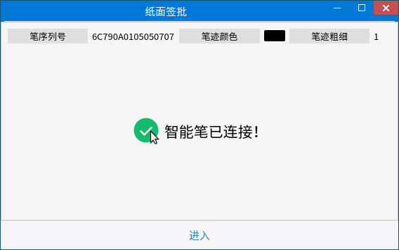
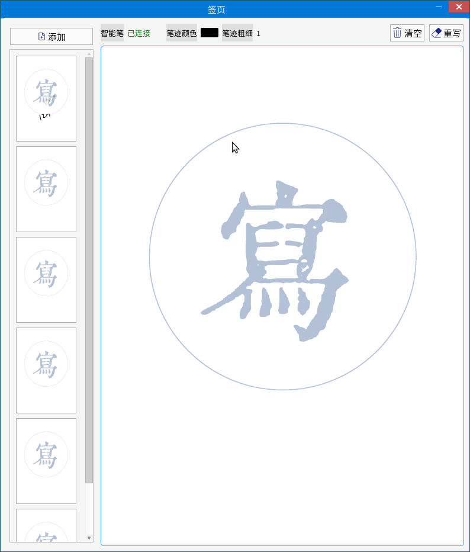
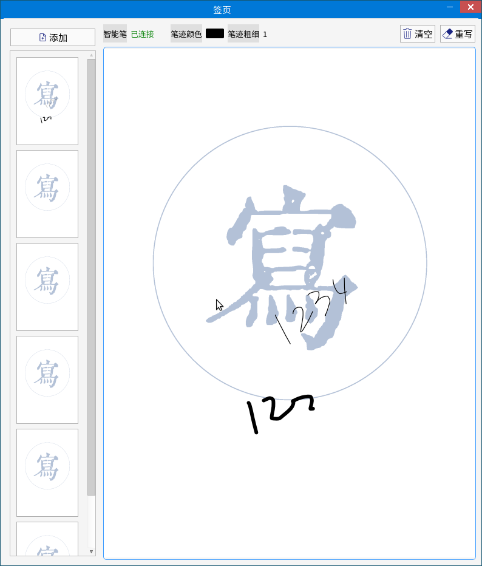

# DotpenDemo [麒麟](https://www.kylinos.cn/)互认证点阵笔Demo

+ 由[纸面签批](https://github.com/feast107/PaperSign)提取出视图和逻辑
+ 点阵笔SDK由[腾千里](https://www.tqltech.com/)提供   


---
   

---

# 索引 
+ [预览](#预览一下)
+ [目录](#目录结构)
+ [导入](#外部导入)
+ [构建](#关于构建)
+ [驱动](#关于驱动)
+ [打包](#关于打包)
+ [相关](#相关资源)
---
# 开始
> 这是一个精简的基架
+ ## 预览一下
    

---
+ ## 目录结构
    |目录|描述|
    |:---:|:---|
    |[Component](./Component/README.md)|工作的核心组件|
    |[Configuration](./Configuration/README.md)|主要配置项，预定义的字符串|
    |[Drawer](./Drawer/README.md)|笔迹绘制器|
    |[Form](./Form/README.md)|页面目录|
    |[Include](./Include/README.md)|SDK头文件目录|
    |[lib](./lib/)|静态库目录|
    |[Models](./Models/README.md)|模型层|
    |[Resource](./Resource/)|静态资源|
    |[SDK](./SDK/)|SDK库目录|

---
+ ## 外部导入

   ### 本项目引用了外部项目 [QtTool](https://github.com/feast107/QTTool)   

    构建之后将项目下的 `Include` 目录添加到 `DotpenDemo.pro` 项目文件中   

    ``` qt
    INCLUDEPATH += {...}/QtTool/Include //包含目录
    DEPENDPATH += {...}/QtTool/Include //依赖目录
    ```

    生成的静态库文件添加到
    ``` qt
    LIBS += {...}/ -lQtTool //动态
    PRE_TARGETDEPS += {...}/ -libQtTool //静态
    ```

    或者自行移动到 `lib` 目录下


    `pch.h` 文件中已经包含了对 `QtTool` 的引用
    ``` c++
    #include<QtTool_global.h>
    ```

---
+ ## 关于构建

    在 `PaperSign.pro` 文件中通过修改 `DEFINES` 来更改对不同架构的SDK引用

    ``` qt
    DEFINES += MIPS/x86 ...
    ```
     ### Linux特性
    由于 `Linux` 下二进制构建可以决定动态链接库的搜索路径，可以在编译器选项中添加 `-Wl,rpath` 来指定库目录，那么在Qt项目文件 `PaperSign.pro` 中可以通过：
    ``` qt
    QMAKE_LFLAGS += -Wl,rpath=./{ dir }
    ```
    来指定库目录


    前置条件，安装以下的库

    ``` sh
    apt-get install libudev
    ```

---
+ ## 关于驱动
    驱动文件名需满足 `*.rules` 的格式   
    例：
    ``` sh
    SUBSYSTEMS=="usb", //设备协议
    ATTRS{idVendor}=="0c45", //设备批号
    ATTRS{idProduct}=="7099",//设备序列号
    GROUP="users",//用户位
    MODE="0666"//权限位
    ```
    
---
+ ## 关于打包
    `Ubuntu` 系统下打包按照`DEB`目录结构配置   
    打包需要在非 `root` 用户环境下

    ``` c
    DEB
    |-- papersign
        |-- DEBIAN //打包描述文件目录
        |   |-- control
        |   |-- postinst
        |-- etc //驱动目录
        |   |-- udev
        |       |-- rules.d
        |           |-- dotpen.rules
        |-- opt //应用程序目录
        |   |-- zbform
        |       |-- PaperSign
        |           |-- PaperSign
        |-- usr 
            |-- lib //动态库目录
            |   |-- *.so ...
            |-- share 
                |-- applications //快捷方式目录
                |   |-- papersign.desktop
                |-- icons // 应用图标目录
                    |-- zbform
                        |-- PaperSign
                            | -- logo.png
    ```
    进入`DEB/papersign`目录
    ``` 
    dpkg -b ../ papersign_{version}_{arch}.deb
    ```
    构建完成后会在上级目录生成`.deb`文件

    在需要安装的系统下执行如下进行安装

    ```
    dpkg -i *.deb
    ```
+ ## 相关资源

    相关资源放置在 [.docs](./.docs/) 目录下可供查看

---

# 关于[我们](https://www.zbform.com/)